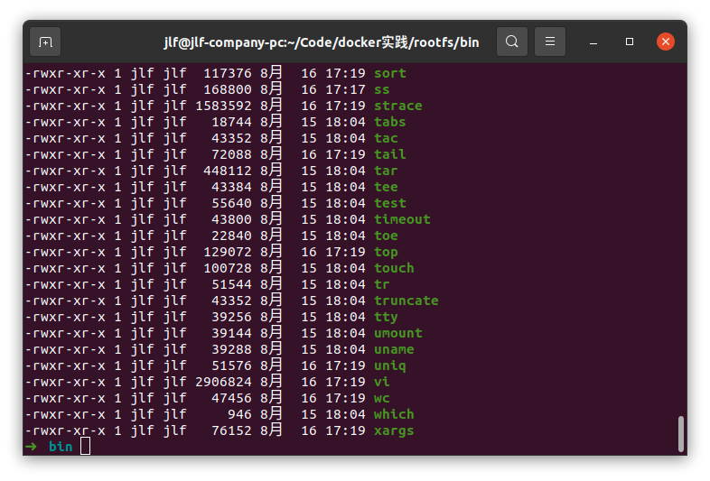
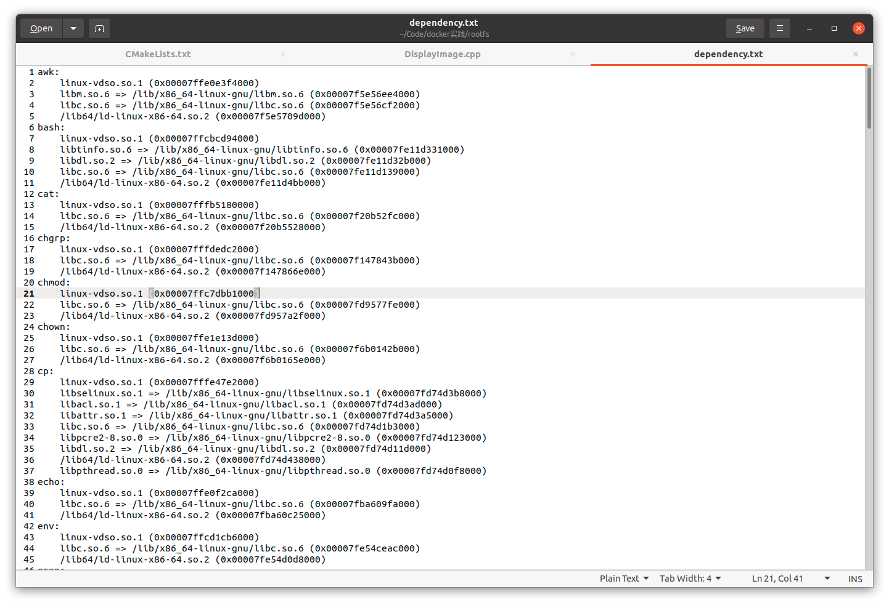

记录一些自己高频的 `sed` 用法。

## 替换
使用`sed`进行文本替换很方便。


## 实践1
这个例子来自酷壳的`docker`教程。有如下的二进制程序，需要找到他们的所有依赖并拷贝到指定的文件夹下：

### ldd导出依赖
`
ldd *
`
得到的结果诸如：

### 提取依赖中的文件路径并去除重复
利用`awk`，可以发现只要取出每一行第三列的内容即可，即
```
awk '{if (match($3,"/")){ print $3}}'
```
接下来要解决结果中有大量依赖库重复的问题，dep.txt是过滤后的文件:
```
awk '!a[$0]++{print $3}' ../dep.txt
```
最终得到的文件：
```
/lib/x86_64-linux-gnu/libm.so.6
/lib/x86_64-linux-gnu/libc.so.6
/lib/x86_64-linux-gnu/libtinfo.so.6
/lib/x86_64-linux-gnu/libdl.so.2
/lib/x86_64-linux-gnu/libselinux.so.1
/lib/x86_64-linux-gnu/libacl.so.1
/lib/x86_64-linux-gnu/libattr.so.1
/lib/x86_64-linux-gnu/libpcre2-8.so.0
/lib/x86_64-linux-gnu/libpthread.so.0
/lib/x86_64-linux-gnu/libpcre.so.3
/lib/x86_64-linux-gnu/libelf.so.1
/lib/x86_64-linux-gnu/libmnl.so.0
/lib/x86_64-linux-gnu/libbsd.so.0
/lib/x86_64-linux-gnu/libcap.so.2
/lib/x86_64-linux-gnu/libz.so.1
/lib/x86_64-linux-gnu/libprocps.so.8
/lib/x86_64-linux-gnu/libsystemd.so.0
/lib/x86_64-linux-gnu/librt.so.1
/lib/x86_64-linux-gnu/liblzma.so.5
/lib/x86_64-linux-gnu/liblz4.so.1
/lib/x86_64-linux-gnu/libgcrypt.so.20
/lib/x86_64-linux-gnu/libgpg-error.so.0
/lib/x86_64-linux-gnu/libmount.so.1
/lib/x86_64-linux-gnu/libblkid.so.1
/lib/x86_64-linux-gnu/libresolv.so.2
/lib/x86_64-linux-gnu/libunwind-ptrace.so.0
/lib/x86_64-linux-gnu/libunwind-x86_64.so.8
/lib/x86_64-linux-gnu/libunwind.so.8
/lib/x86_64-linux-gnu/libtic.so.6
/lib/x86_64-linux-gnu/libcanberra.so.0
/lib/x86_64-linux-gnu/libgpm.so.2
/lib/x86_64-linux-gnu/libpython3.8.so.1.0
/lib/x86_64-linux-gnu/libvorbisfile.so.3
/lib/x86_64-linux-gnu/libtdb.so.1
/lib/x86_64-linux-gnu/libltdl.so.7
/lib/x86_64-linux-gnu/libexpat.so.1
/lib/x86_64-linux-gnu/libutil.so.1
/lib/x86_64-linux-gnu/libvorbis.so.0
/lib/x86_64-linux-gnu/libogg.so.0
```