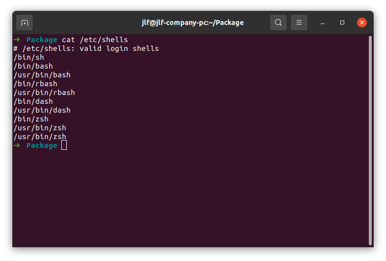
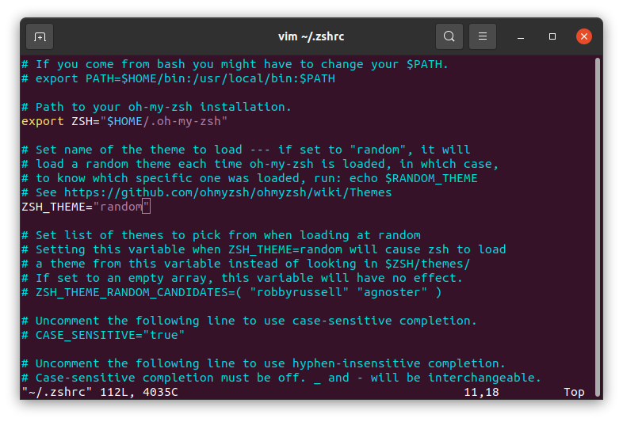
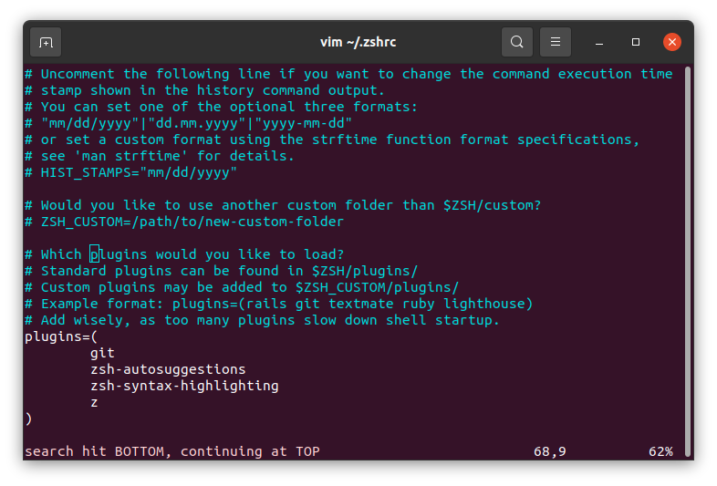
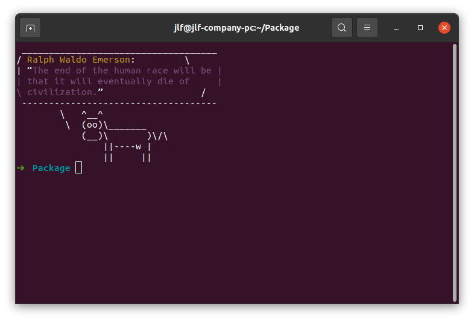

打造一个高效的命令行对程序员提高工作效率十分重要，下面总结一下`zsh`的使用心得。

## 简介
功能比`bash`等更为强大的一个`shell`。配合`oh-my-zsh`使用来简化其配置。

## Ubuntu等Debian系
### 安装 zsh
查看是否系统已经支持的`shell`,如果有`zsh`就表示已经存在了：
```
cat /etc/shells
```

```
如果没有安装则可以使用`apt`安装
sudo apt install zsh
```

### 配置 oh-my-zsh
执行脚本安装：
```
sh -c "$(wget https://raw.github.com/ohmyzsh/ohmyzsh/master/tools/install.sh -O -)"
```
oh-my-zsh提供了一系列丰富的主题和插件，默认在`~/.oh-my-zsh/themes`中可以找到。
要使其生效我们要修改`~/.oh-my-zsh`——zsh配置文件。
修改`ZSH_THEME`字段启用主题：

修改`plugins`字段启用插件：



根据个人喜好选择喜欢的[主题](https://github.com/ohmyzsh/ohmyzsh/wiki/Themes)即可，默认主题其实也算好用。

### 插件推荐
#### zsh-autosuggestions
自动补全（需要安装）：
```
git clone https://github.com/zsh-users/zsh-autosuggestions ${ZSH_CUSTOM:-~/.oh-my-zsh/custom}/plugins/zsh-autosuggestions
```
#### copyfile
把文件内容拷贝到系统剪辑板：
```
copyfile SRC
```
#### copypath
把路径拷贝到系统剪辑板，缺省时拷贝当前路径：
```
copypath [SRC]
```
#### extract
解决令人头秃的解压命令

#### omz reload
omz下有一系列`oh my zsh`自带的命令，这一条可以快速重载`zsh`配置

#### colored-man-pages
显示彩色的系统手册

#### rand-quote
随机格言，配合cowsay，可以实现牛说格言效果：
```
sudo apt install cowsay
echo "quote|cowsay" >> ~/.zshrc
```
每次打开终端效果如下：
